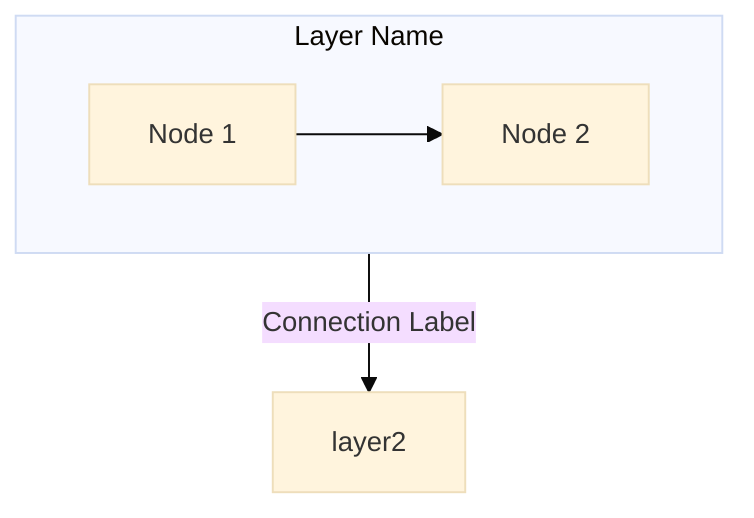
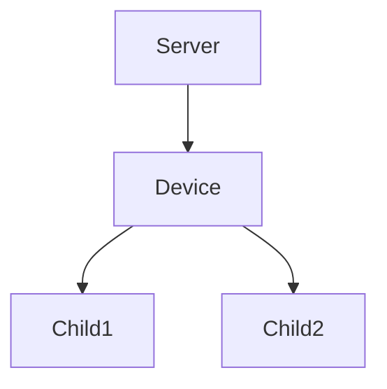

# mermaid-diagrams

Mermaid diagrams in this repo's Sphinx/MyST documentation.

## Already configured here

Mermaid is wired up — `docs/conf.py` and `docs/_static/custom.css`
already exist. Don't re-add the extension or CSS unless you're
fixing them. Example diagrams: `docs/explanations/architecture-overview.md`.

The setup blocks below are for reference when porting this skill to
another repo, or when debugging a regression in this one.

## When to use Mermaid vs ASCII art

| Diagram type | Recommendation | Reason |
|--------------|----------------|--------|
| Architecture / layer diagrams | Mermaid | Labelled component relationships |
| Data / control flow | Mermaid | Directional arrows with labels |
| File / folder trees | ASCII art | `├─ └─ │` are compact and readable |
| Device hierarchy trees | ASCII art | Matches what users see in TwinCAT etc. |
| Deeply nested structures | ASCII art | Mermaid compresses nesting badly |

**Do NOT convert to Mermaid:**

- File / folder tree views
- Hierarchy trees showing parent-child nesting
- Any diagram where the tree structure *is* the information
- TwinCAT device-tree views in `docs/explanations/nomenclature.md`
  (keep as ASCII)

ASCII tree characters for copy/paste: `├─` `└─` `│`

## Mermaid syntax in MyST

````markdown

````

Key patterns:

- `flowchart TB` (top-to-bottom) for architecture diagrams.
- `direction LR` inside a subgraph for horizontal layout within a
  vertical flow.
- `%%{init: {...}}%%` for per-diagram config.
- Node names with spaces need quotes: `["My Node Name"]`.
- Multi-line text uses `<br/>`: `["Line 1<br/>Line 2"]`.
- Keep subgraph titles short — long ones get clipped.

## Converting ASCII art to Mermaid (when appropriate)

ASCII:

```
Server
└── Device
    ├── Child1
    └── Child2
```

Mermaid:



## Common gotchas

- `mermaid_output_format = "svg"` needs the `mmdc` CLI installed
  (not available by default). Use `"raw"` (browser JS rendering).
- Too many nested subgraphs → diagram compresses, becomes unreadable.
  Use `direction LR` inside subgraphs and move detail to a separate
  table/list.
- Long subgraph titles get clipped in the rendered output.

## Setup reference (for new repos / debugging)

1. Add `sphinxcontrib-mermaid` to `pyproject.toml` dev deps.

2. Add to `docs/conf.py`:

   ```python
   extensions = [
       # ... other extensions
       "sphinxcontrib.mermaid",
   ]

   mermaid_output_format = "raw"
   mermaid_init_js = """
   mermaid.initialize({
       startOnLoad: true,
       securityLevel: 'loose',
       theme: 'default',
       flowchart: {
           useMaxWidth: true,
           htmlLabels: true
       }
   });
   """

   myst_fence_as_directive = ["mermaid"]

   html_static_path = ["_static"]
   html_css_files = ["custom.css"]
   ```

3. `docs/_static/custom.css` — full-width diagrams + modal/zoom
   sizing. See the existing file in this repo for the canonical
   version; the CSS is verbose but boilerplate.
