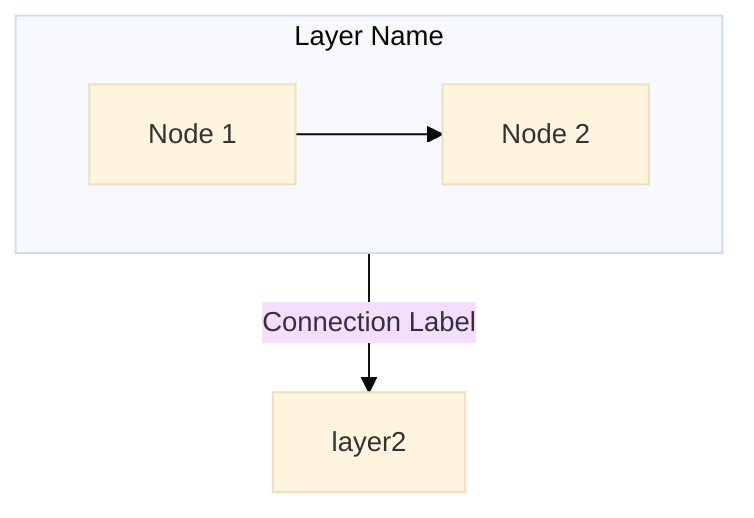
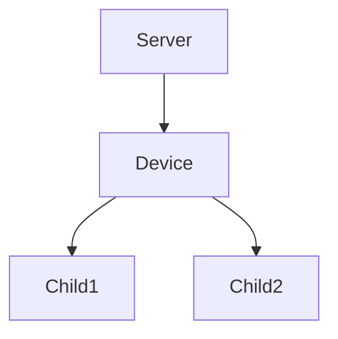

# Reusable Agent Skills

This file contains generic, reusable skills that are not specific to any particular repository. These can be copied to other projects or referenced as needed.

For repository-specific skills, see [AGENTS.md](AGENTS.md).

---

## Mermaid Diagrams in Documentation Skill

**Activation prompts:**
- "Load Mermaid diagram skill"
- "Help me add diagrams to documentation"
- "Convert ASCII art to Mermaid"
- "I need to create architecture diagrams"
- "How do I use Mermaid in MyST markdown"

**Skill context:** Creating and styling Mermaid diagrams in Sphinx/MyST documentation

**Setup requirements:**

1. **Dependencies** - Add to `pyproject.toml` dev dependencies:
   ```toml
   "sphinxcontrib-mermaid",
   ```

2. **Sphinx extensions** - Add to `docs/conf.py`:
   ```python
   extensions = [
       # ... other extensions
       "sphinxcontrib.mermaid",
   ]

   # Mermaid diagram configuration - use raw HTML for JS-based rendering
   mermaid_output_format = "raw"
   mermaid_init_js = """
   mermaid.initialize({
       startOnLoad: true,
       securityLevel: 'loose',
       theme: 'default',
       flowchart: {
           useMaxWidth: true,
           htmlLabels: true
       }
   });
   """

   # Enable mermaid fenced code blocks in MyST
   myst_fence_as_directive = ["mermaid"]
   ```

3. **Custom CSS for full-width diagrams** - Create `docs/_static/custom.css`:
   ```css
   /* Make mermaid diagrams use full width */
   .mermaid {
       width: 100% !important;
       max-width: 100% !important;
   }

   .mermaid svg {
       width: 100% !important;
       max-width: 100% !important;
       height: auto !important;
   }

   /* Make expanded/fullscreen mermaid diagrams prioritize width with vertical scroll */
   .mermaid-modal,
   .mermaid-fullscreen,
   [class*="modal"] .mermaid,
   [class*="fullscreen"] .mermaid,
   [class*="expanded"] .mermaid,
   .mermaid-zoom-modal,
   .sd-modal .mermaid,
   .modal-content .mermaid,
   dialog .mermaid {
       width: 95vw !important;
       max-width: 95vw !important;
       height: auto !important;
       max-height: none !important;
       overflow-y: auto !important;
       overflow-x: hidden !important;
   }

   .mermaid-modal svg,
   .mermaid-fullscreen svg,
   [class*="modal"] .mermaid svg,
   [class*="fullscreen"] .mermaid svg,
   [class*="expanded"] .mermaid svg,
   .mermaid-zoom-modal svg,
   .mermaid-zoom-modal .mermaid svg,
   .sd-modal .mermaid svg,
   .modal-content .mermaid svg,
   dialog .mermaid svg {
       width: 95vw !important;
       min-width: 95vw !important;
       max-width: none !important;
       height: auto !important;
       max-height: none !important;
   }

   /* Target the modal/dialog container itself to allow scrolling */
   .mermaid-zoom-modal,
   .sd-modal,
   .modal-content,
   dialog {
       max-height: 95vh !important;
       overflow-y: auto !important;
       overflow-x: hidden !important;
   }
   ```

4. **Register CSS in conf.py**:
   ```python
   html_static_path = ["_static"]
   html_css_files = ["custom.css"]
   ```

**Mermaid syntax in MyST markdown:**

````markdown

````

**Key patterns:**

- Use `flowchart TB` (top-to-bottom) for architecture diagrams
- Use `direction LR` inside subgraphs for horizontal layout within vertical flow
- Use `%%{init: {...}}%%` for per-diagram configuration
- Node names with spaces need quotes: `["My Node Name"]`
- Multi-line text uses `<br/>`: `["Line 1<br/>Line 2"]`
- Shorten long subgraph titles to prevent clipping

**When to use Mermaid vs ASCII art:**

| Diagram Type | Recommendation | Reason |
|--------------|----------------|--------|
| Architecture/layer diagrams | Mermaid | Shows component relationships with labeled connections |
| Data/control flow | Mermaid | Arrows clearly show direction and can have labels |
| File/folder trees | ASCII art | Tree lines (├─ └─ │) are compact and readable |
| Device hierarchy trees | ASCII art | Matches what users see in UI tools |
| Nested structures | ASCII art | Mermaid compresses deeply nested subgraphs |

**ASCII tree characters for copy/paste:**
```
├─  (branch)
└─  (last branch)
│   (vertical line)
```

**Do NOT convert to Mermaid:**
- File/folder tree views
- Hierarchy trees showing parent-child nesting
- Any diagram where the tree structure IS the information

**Converting ASCII art to Mermaid (when appropriate):**

ASCII tree like:
```
Server
└── Device
    ├── Child1
    └── Child2
```

Becomes:


**Common gotchas:**
- ❌ `mermaid_output_format = "svg"` requires `mmdc` CLI installed (not available by default)
- ✅ `mermaid_output_format = "raw"` uses browser-based JS rendering (no extra install)
- ❌ Too many nested subgraphs → diagram compresses and becomes unreadable
- ✅ Use `direction LR` within subgraphs + move detail to separate table/list
- ❌ Long subgraph titles → get clipped in rendered output
- ✅ Keep subgraph titles short
