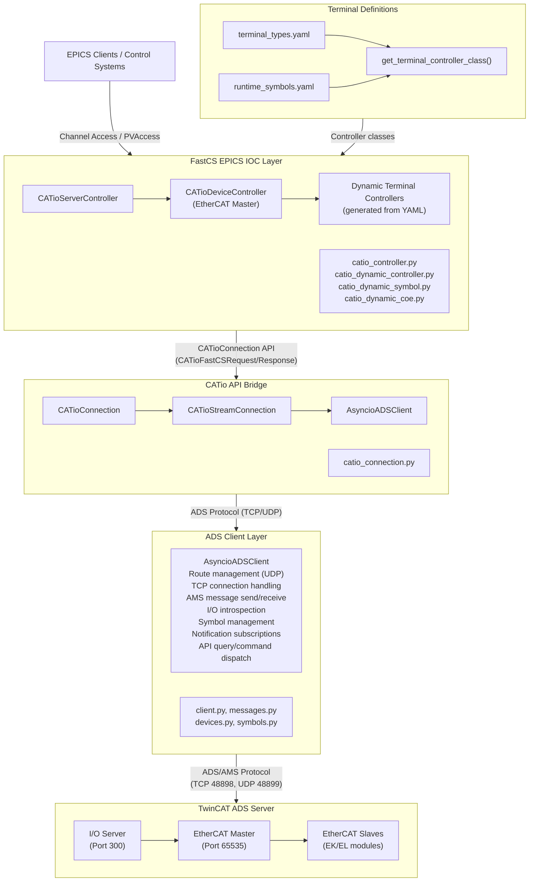
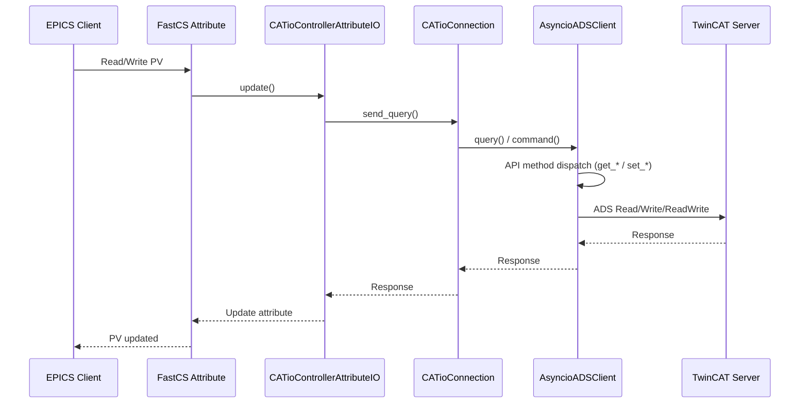

# CATio Architecture Overview

CATio is a Python-based control system integration for EtherCAT I/O devices running under Beckhoff TwinCAT. The architecture is deliberately designed with a clean separation between two halves:

1. **FastCS EPICS IOC Layer** - Exposes Process Variables (PVs) for controlling EtherCAT devices
2. **ADS Client Layer** - Communicates with TwinCAT ADS servers on Beckhoff PLCs

## High-Level Architecture Diagram



## Component Overview

### FastCS EPICS IOC Layer

The top layer provides EPICS integration through the FastCS framework:

- **CATioServerController**: Root controller representing the I/O server; manages TCP connections and device discovery
- **CATioDeviceController**: Represents EtherCAT Master devices with their associated attributes
- **Dynamic Terminal Controllers**: Generated at runtime from YAML terminal definitions (see below)
- **CATioControllerAttributeIO**: Handles attribute read/write operations through the API

### Dynamic Controller Generation

Terminal controllers are generated dynamically from YAML definitions in `src/catio_terminals/terminals/`:

- **`get_terminal_controller_class()`**: Factory function that creates controller classes on demand
- **`catio_dynamic_controller.py`**: Creates FastCS controller classes from YAML terminal type definitions
- **`catio_dynamic_symbol.py`**: Adds PDO symbol attributes (process data) to controllers
- **`catio_dynamic_coe.py`**: Adds CoE parameter attributes (configuration) to controllers
- **`catio_dynamic_types.py`**: Type conversion between TwinCAT, numpy, and FastCS types

Controller classes are cached so only one class is created per terminal type:

```python
from fastcs_catio.catio_dynamic_controller import get_terminal_controller_class

# Get or create a controller class for a terminal type
controller_class = get_terminal_controller_class("EL1004")

# Use it like any other controller class
controller = controller_class(name="MOD1", node=node)
```

### API Bridge Layer

The middle layer provides a clean interface between FastCS and the ADS client:

- **CATioConnection**: Singleton managing the TCP connection lifecycle
- **CATioStreamConnection**: Wraps the ADS client with async context management
- **CATioFastCSRequest/Response**: Request/response objects for API communication

### ADS Client Layer

The bottom layer implements the TwinCAT ADS protocol:

- **AsyncioADSClient**: Asynchronous ADS client handling all protocol communication
- **RemoteRoute**: UDP-based route management for network discovery
- **Message classes**: Structured ADS message types for various commands
- **Device/Symbol models**: Data classes representing EtherCAT hardware and ADS symbols

## Data Flow

### Initialization Flow

1. **Route Discovery**: UDP communication discovers the remote TwinCAT server's AMS NetId
2. **Route Addition**: Client machine is added to the TwinCAT server's routing table
3. **TCP Connection**: Establish persistent TCP connection for ADS communication
4. **I/O Introspection**: Query server for devices, slaves, and symbol information
5. **Dynamic Controller Creation**: Generate controller classes from YAML definitions based on discovered terminal types
6. **Attribute Registration**: Create EPICS PVs for each accessible parameter (symbols and CoE objects)

### Runtime Data Flow



## Key Design Decisions

### Dynamic Controller Generation

Terminal controllers are generated from YAML definitions rather than explicit Python classes:

- **Flexibility**: New terminal types can be added by editing YAML without code changes
- **Maintainability**: Single source of truth for terminal definitions in `terminal_types.yaml`
- **Runtime symbols**: Diagnostic symbols from the EtherCAT master defined separately in `runtime_symbols.yaml`
- **Selection**: Only symbols marked `selected: true` in YAML become FastCS attributes

### Asynchronous Architecture

The entire stack uses Python's `asyncio` for non-blocking I/O operations:

- Enables concurrent handling of multiple PV requests
- Supports continuous notification monitoring without blocking
- Allows efficient polling of device states

### Controller Hierarchy

Controllers form a tree structure mirroring the physical EtherCAT topology:

```
IOServer
└── IODevice (EtherCAT Master)
    ├── IOSlave (EK1100 Coupler)
    │   ├── IOSlave (EL3xxx Input) - DynamicEL3xxxController
    │   └── IOSlave (EL4xxx Output) - DynamicEL4xxxController
    └── IOSlave (EK1101 Coupler)
        └── ...
```

### Symbol-Based Access

ADS symbols provide named access to device parameters rather than raw memory addresses:

- Symbols discovered during introspection
- Notification subscriptions for efficient updates
- Type information preserved for proper data conversion

## Configuration

CATio is configured through command-line parameters:

- **target_ip**: IP address of the Beckhoff PLC
- **target_port**: AMS port for the I/O device (typically 851 for TwinCAT)
- **poll_period**: Interval for standard attribute polling
- **notification_period**: Interval for processing ADS notifications

## See Also

- [FastCS EPICS IOC Implementation](fastcs-epics-ioc.md) - Details of the EPICS layer
- [ADS Client Implementation](ads-client.md) - Details of the ADS protocol layer
- [Terminal YAML Definitions](terminal-yaml-definitions.md) - How to define terminal types in YAML
- [API Decoupling Analysis](decisions/0003-api-decoupling-analysis.md) - Discussion of the API design and potential improvements
