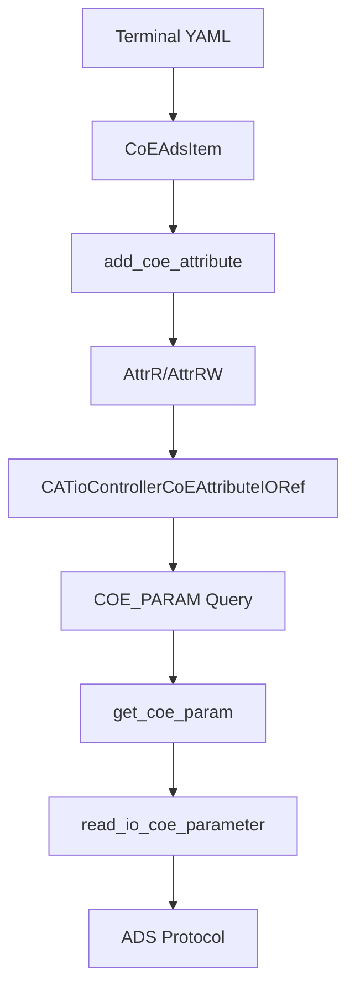

# CoE Parameters

This page explains how CANopen over EtherCAT (CoE) parameters work in fastcs-catio.

## What are CoE Parameters?

CoE (CANopen over EtherCAT) is a protocol that allows access to device parameters on EtherCAT terminals. Unlike process data (PDOs) which update cyclically, CoE parameters are read/written on demand and typically contain configuration settings, device identification, and diagnostic information.

## CoE Addressing

CoE parameters are addressed using an **index** and **subindex**:

- **Index**: A 16-bit value (4 hex digits, e.g., `0x1000`)
- **Subindex**: An 8-bit value, but formatted as 4 hex digits for consistency (e.g., `0x0000`)

### Standard CoE Indices

Beckhoff terminals follow the CANopen standard for common indices:

| Index | Name | Typical Type | Description |
|-------|------|--------------|-------------|
| 0x1000 | Device Type | UDINT | Device type identifier |
| 0x1008 | Device Name | STRING | Human-readable device name (e.g., "EL1502") |
| 0x1009 | Hardware Version | STRING | Hardware revision |
| 0x100A | Firmware Version | STRING | Firmware/software revision |
| 0x1018 | Identification | Various | Vendor ID, product code, revision |
| 0x8000+ | Operational Settings | Various | Terminal-specific configuration |

## YAML Definition

CoE objects are defined in terminal YAML files under the `coe_objects` key:

```yaml
coe_objects:
  - index: 4096          # 0x1000 in decimal
    name: Device type
    type_name: UDINT
    bit_size: 32
    access: ro           # "ro" = read-only, "rw" = read-write
    subindices: []
    fastcs_name: device_type

  - index: 4104          # 0x1008 in decimal
    name: Device name
    type_name: STRING(6)
    bit_size: 48
    access: ro
    subindices: []
    fastcs_name: device_name
```

### Field Descriptions

- **index**: The CoE index as a decimal integer
- **name**: Human-readable name from Beckhoff documentation
- **type_name**: TwinCAT/IEC 61131-3 type (UDINT, UINT, STRING(n), etc.)
- **bit_size**: Size in bits (used for compound types)
- **access**: Access mode - "ro" (read-only) or "rw" (read-write)
- **subindices**: List of subindex definitions for complex objects
- **fastcs_name**: The attribute name exposed in FastCS (snake_case)

## Implementation Architecture

The CoE parameter system uses several components:



### Key Classes

- **CoEAdsItem**: Dataclass holding CoE object metadata from YAML (index, subindex, type, access)
- **CATioControllerCoEAttributeIORef**: IO reference storing the CoE address and data type for FastCS
- **AmsAddress**: The EtherCAT device address obtained via `client.get_coe_ams_address(terminal)`

## Type Mapping

TwinCAT types are mapped to numpy dtypes and FastCS datatypes:

| TwinCAT Type | NumPy dtype | FastCS DataType |
|--------------|-------------|-----------------|
| BOOL | bool | Int() |
| SINT, INT, DINT, LINT | int8, int16, int32, int64 | Int() |
| USINT, UINT, UDINT, ULINT | uint8, uint16, uint32, uint64 | Int() |
| REAL, LREAL | float32, float64 | Float() |
| STRING(n) | S{n} | String(n+1) |

Note: String types add +1 to accommodate the null terminator that CoE reads include.

## Common Issues and Solutions

### Index/Subindex Format

The `check_coe_indices_format` function expects both index and subindex as 4-character hex strings (after removing `0x` prefix):

```python
# Correct: Both are 4 hex digits
index_hex = "0x1000"      # -> "1000"
subindex_hex = "0x0001"   # -> "0001"

# Wrong: Subindex too short
subindex_hex = "0x01"     # -> "01" (only 2 chars - will fail!)
```

### String Buffer Size

CoE string reads include a null terminator. The FastCS String datatype must account for this:

```python
# For STRING(6), the response will be 7 bytes: "EL1502\0"
# So we create String(7), not String(6)
if dtype.kind == "S":
    return String(dtype.itemsize + 1)
```

### Missing Query Methods

The client must have `get_coe_param` and `set_coe_param` methods to handle the `COE_PARAM` query command used by the attribute IO system. Without these, CoE reads fail silently and return empty strings.

## Read vs Write Access

CoE parameters have access modes that determine whether they can be modified:

- **Read-only (ro)**: Creates `AttrR` - value can only be read
- **Read-write (rw)**: Creates `AttrRW` - value can be read and written

The access mode is determined by the `readonly` property on `CoEAdsItem`, which checks for patterns like "ro", "Read-only" (readonly) vs "rw", "Read/Write" (read-write).

## Primitive vs Compound Types

CoE objects can have:

- **Primitive types**: UINT, DINT, STRING, etc. - these create FastCS attributes
- **Compound types**: DT8020, custom structures - these are skipped (no io_ref created)

The `is_primitive_type` property checks if the type is in the known TwinCAT type mapping or matches the `STRING(n)` pattern.
