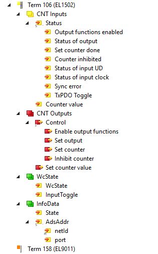

# EtherCAT and TwinCAT Nomenclature

This document explains the terminology used in TwinCAT's device tree when viewing EtherCAT terminals, and how these concepts map to Beckhoff ESI XML files and our terminal YAML definitions.

## TwinCAT Device Tree

The screenshot below shows a typical TwinCAT device tree for an EL1502 counter terminal:



```
├─ Term 106 (EL1502)              ← Terminal / EtherCAT Slave
│  ├─ CNT Inputs                  ← TxPDO (inputs to controller)
│  │  ├─ Status                   ← PDO Entry (composite)
│  │  │  ├─ Output functions enabled   ← Bit field
│  │  │  ├─ Status of output           ← Bit field
│  │  │  ├─ Set counter done           ← Bit field
│  │  │  ├─ Counter inhibited          ← Bit field
│  │  │  ├─ Status of input UD         ← Bit field
│  │  │  ├─ Status of input clock      ← Bit field
│  │  │  ├─ Sync error                 ← Bit field
│  │  │  └─ TxPDO Toggle               ← Bit field
│  │  └─ Counter value            ← PDO Entry (value)
│  ├─ CNT Outputs                 ← RxPDO (outputs from controller)
│  │  ├─ Control                  ← PDO Entry (composite)
│  │  │  ├─ Enable output functions    ← Bit field
│  │  │  ├─ Set output                 ← Bit field
│  │  │  ├─ Set counter                ← Bit field
│  │  │  └─ Inhibit counter            ← Bit field
│  │  └─ Set counter value        ← PDO Entry (value)
│  ├─ WcState                     ← Runtime Symbol Group
│  │  ├─ WcState                  ← Working Counter state
│  │  └─ InputToggle              ← Data freshness toggle
│  └─ InfoData                    ← Runtime Symbol Group
│     ├─ State                    ← EtherCAT state machine
│     └─ AdsAddr                  ← ADS addressing
│        ├─ netId                 ← Network identifier
│        └─ port                  ← ADS port
└─ Term 158 (EL9011)              ← Next terminal
```

## Terminology Reference

| Element in Tree | Terminology | Description |
|-----------------|-------------|-------------|
| **Term 106 (EL1502)** | **Terminal** / **EtherCAT Slave** | A physical device on the EtherCAT bus. Each terminal has a unique position and identity (vendor ID, product code, revision). |
| **CNT Inputs** | **TxPDO** (Transmit PDO) | Process Data Object transmitted FROM the terminal TO the controller. These are your **inputs** (read-only from the controller's perspective). |
| **CNT Outputs** | **RxPDO** (Receive PDO) | Process Data Object received BY the terminal FROM the controller. These are your **outputs** (read/write from the controller's perspective). |
| **Status** | **PDO Entry** (composite) | A structured entry within the PDO containing multiple bit fields packed together. In TwinCAT, this becomes a composite type. |
| **Output functions enabled**, **Status of output**, etc. | **PDO Entry Fields** / **Bits** | Individual fields (often single bits) within a Status or Control word. |
| **Counter value** | **PDO Entry** (value) | A data entry within the PDO, typically 16 or 32 bits representing a measured or computed value. |
| **Control** | **PDO Entry** (composite) | A structured entry containing control bits that command the terminal's behavior. |
| **Set counter value** | **PDO Entry** (value) | An output value to write to the terminal. |
| **WcState** | **Runtime Symbol** | Diagnostic symbol added by the EtherCAT Master at runtime. Indicates communication health (Working Counter state). Not defined in Beckhoff XML. |
| **InputToggle** | **Runtime Symbol** | Toggles each EtherCAT cycle to indicate data freshness. Added by the EtherCAT Master. |
| **InfoData** | **Runtime Symbol Group** | Diagnostic information group added by the EtherCAT Master. |
| **State** | **Runtime Symbol** | EtherCAT state machine state (Init, Pre-Op, Safe-Op, Op). |
| **AdsAddr** | **Runtime Symbol Group** | ADS addressing information for the terminal. |
| **netId**, **port** | **Runtime Symbols** | Network identifier and ADS port for direct terminal communication. |

## Key Concepts

### PDO (Process Data Object)

PDOs are the cyclic I/O data exchanged every EtherCAT cycle. They contain the real-time process data.

- **TxPDO** = "Transmit" from the slave's perspective → controller **inputs** (read-only)
- **RxPDO** = "Receive" from the slave's perspective → controller **outputs** (read/write)

### PDO Entry

A single data item within a PDO. Can be:
- A single **bit** (e.g., status flags)
- A **primitive value** (BOOL, INT, UINT, DINT, etc.)
- A **composite structure** grouping multiple fields (e.g., Status word with bit fields)

### Runtime Symbols

Symbols added by the EtherCAT Master at runtime that are **not defined in Beckhoff's ESI XML files**. These provide diagnostics and addressing information:

- `WcState` - Working Counter state for communication health
- `InputToggle` - Data freshness indicator
- `InfoData` - State machine and addressing info

## Mapping to ESI XML

In Beckhoff's ESI XML files:

| TwinCAT Tree | XML Element |
|--------------|-------------|
| Terminal (EL1502) | `<Device>` |
| CNT Inputs | `<TxPdo>` |
| CNT Outputs | `<RxPdo>` |
| Status, Counter value, etc. | `<Entry>` within the PDO |
| Individual bits | `<Entry>` with `<BitLen>1</BitLen>` |

Example XML structure:
```xml
<TxPdo Fixed="1" Sm="3">
  <Index>#x1a00</Index>
  <Name>CNT Inputs Channel 1</Name>
  <Entry>
    <Index>#x6000</Index>
    <SubIndex>1</SubIndex>
    <BitLen>1</BitLen>
    <Name>Status__Output functions enabled</Name>
    <DataType>BOOL</DataType>
  </Entry>
  <Entry>
    <Index>#x6000</Index>
    <SubIndex>17</SubIndex>
    <BitLen>16</BitLen>
    <Name>Counter value</Name>
    <DataType>UINT</DataType>
  </Entry>
</TxPdo>
```

## Mapping to Terminal YAML

In our terminal YAML definitions:

| TwinCAT Tree | YAML Section |
|--------------|--------------|
| Terminal identity | `identity:` (vendor_id, product_code, revision_number) |
| TxPDO/RxPDO entries | `symbol_nodes:` |
| Runtime symbols | Defined in `runtime_symbols.yaml` |
| CoE parameters | `coe_objects:` (not shown in tree, accessed via SDO) |

## Related Documentation

- [Terminal YAML Definitions](terminal-yaml-definitions.md) - How to define terminals in YAML
- [Beckhoff XML Format](../reference/beckhoff-xml-format.md) - ESI XML schema reference
- [Composite Types](composite-types.md) - How TwinCAT generates composite type names
